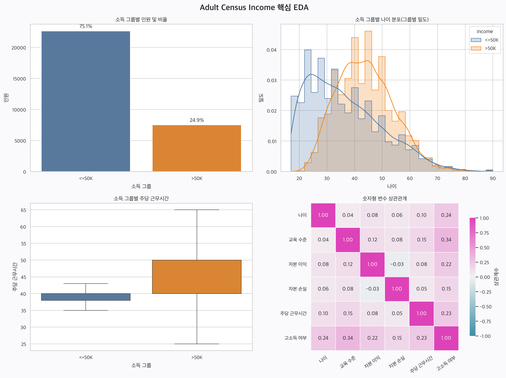

# Adult Census Income 분석 보고서

## 1. 분석 목적

인구조사 정보를 이용해 연 소득이 5만 달러를 초과하는 사람의 특징을 탐색하고,
통계적으로 관계를 확인한 뒤 머신러닝 Pipeline으로 소득 그룹을 예측했다.

## 2. 데이터 준비

- 원본 데이터: UCI Adult Census Income
- 정제 후 데이터: 30,139행, 15열
- 목표 변수: `income` (`<=50K`, `>50K`)
- 처리 방법: `?` 결측치 제거, 중복 행 제거
- 정제 후 고소득자 비율: 24.9%
- Pandas와 Polars 양쪽에서 CSV 로딩 결과 확인

## 3. 시각화

- Seaborn: 소득 인원, 나이 분포, 근무시간, 숫자형 변수 상관관계를 2×2로 구성
- Plotly: 교육 수준별 고소득자 비율 인터랙티브 차트 생성
- Plotly 파일: [education_income_rate.html](output/education_income_rate.html)

## 4. 통계 분석

### 고소득 여부와 숫자형 변수의 상관계수

| 변수 | 상관계수 |
|---|---:|
| `education_num` | 0.335 |
| `age` | 0.242 |
| `hours_per_week` | 0.229 |
| `capital_gain` | 0.221 |
| `capital_loss` | 0.150 |

가장 큰 값은 `education_num`이며, 교육 수준과 고소득 여부 사이에 비교적
뚜렷한 양의 관계가 관찰됐다. 상관관계는 인과관계를 의미하지 않는다.

### 소득 그룹별 주당 근무시간 t-test

- `<=50K` 평균: 39.35시간
- `>50K` 평균: 45.71시간
- t통계량: -43.1697
- p-value: < 0.000001
- 해석: p-value가 0.05보다 작으므로 두 그룹의 평균 근무시간 차이는 통계적으로 유의미하다.

## 5. 머신러닝 Pipeline

- 숫자형 전처리: 결측치 중앙값 대체, 표준화
- 범주형 전처리: 결측치 최빈값 대체, One-Hot Encoding
- 모델: Logistic Regression
- 정확도: 80.5%
- 고소득 그룹 F1 점수: 0.6778
- 저장 모델: `output/adult_income_pipeline.joblib`

## 6. 결론

고소득자는 전체의 24.9%로 적었다. 교육 수준, 나이, 주당 근무시간은
고소득 여부와 양의 관계를 보였으며, 고소득 그룹은 주당 평균 근무시간도 더 길었다.
머신러닝 모델은 평가 데이터에서 80.5%의 정확도와 0.6778의
고소득 그룹 F1 점수를 기록했다. 다만 이 결과는 변수 간 관계를 보여줄 뿐,
특정 특성이 고소득의 직접적인 원인임을 증명하지는 않는다.
